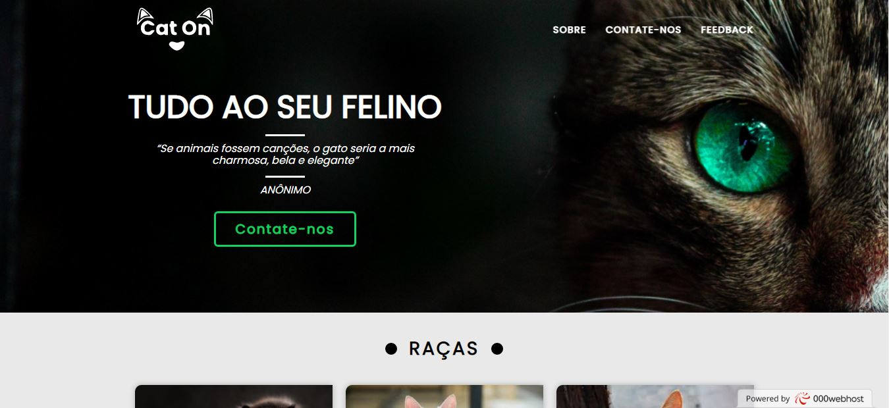

# Cat ON

> A ideia inicial foi criar um website com base na minha criatividade com um tema que muitas pessoas adoram. Utilizei o Figma para fazer o design website.

## 📝 Licença

Esse projeto está sob licença. Veja o arquivo [LICENÇA](LICENSE) para mais detalhes.
